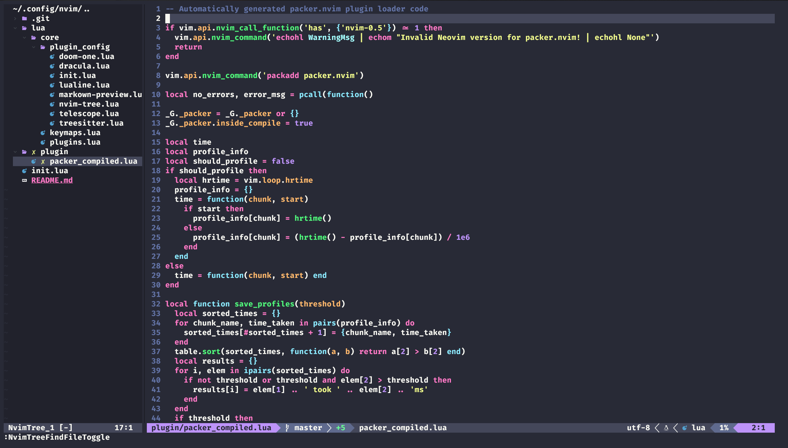

# nvim

This github repo contains my neovim configuration files.

As of now, the config got it looking like this.

I followed a youtube video by Chris Power to get to this configuration.

This image shows the updated one (Added markdown-preview)

